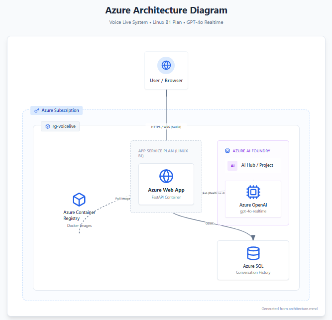

# Real-Time Voice Assistant: Project Overview

This document explains the architecture and deployment considerations for the Real-Time Voice Assistant project.

## Project Description

This application acts as a bridge between a user's browser and the **Azure OpenAI GPT-4o Realtime API**. Unlike standard chatbots that wait for a full message, this system streams audio in real-time, allowing for natural, interruptible voice conversations.

### Core Features

* **Bi-directional Streaming:** Uses WebSockets to stream audio to and from the server.
* **Session Management:** Handles multiple concurrent user connections via Python FastAPI.
* **State Persistence:** Saves conversation context to an Azure SQL Database.
* **Containerized Deployment:** Runs as a Docker container on Azure App Service.

## Azure Architecture Components

The solution is built on Azure Platform-as-a-Service (PaaS) components to ensure scalability and minimize maintenance.

### 1. Azure App Service (Linux B1 Plan)

* **Role:** The application host.
* **Details:** Runs the FastAPI Docker container. It serves the frontend client and manages the WebSocket tunnels between the user and the AI model.
* **Note:** The B1 plan is cost-effective for development but may need scaling for production.

### 2. Azure Container Registry (ACR)

* **Role:** Artifact storage.
* **Details:** Stores the Docker images for the application. When the Web App restarts, it pulls the latest image from here.

### 3. Azure SQL Database

* **Role:** Persistent memory.
* **Details:** Stores chat logs and session history. This ensures that even if the Web App restarts (stateless compute), the conversation history is preserved.

### 4. Azure AI Foundry & OpenAI

* **Role:** The Brain.
* **Details:** Provides the **GPT-4o Realtime** model. The application connects here using a secure backend WebSocket.

## Critical Deployment Considerations

### Security

* **HTTPS is Required:** Browsers will **block microphone access** if the site is loaded over HTTP. You must use the SSL/HTTPS URL provided by Azure (e.g., `https://your-app.azurewebsites.net`).
* **Secret Management:** Database connection strings and API keys are injected as Environment Variables. Never commit these to your Git repository.

### Scalability

* **Session Affinity:** Because this app uses WebSockets, if you scale out to multiple server instances, you **must enable ARR Affinity** in the Azure Portal. This ensures a user's audio packets always go to the same server instance during a session.
* **Database Limits:** The configured "Basic" tier SQL database has a limit on concurrent connections (DTUs). Heavy load may require upgrading to a "Standard" tier.

### Monitoring

* **Logs:** Application logs are streamed to the Azure Portal "Log Stream". Use this to debug WebSocket connection failures or audio encoding issues.

## Quick Start (Deployment)

1. **Prerequisites:** Azure CLI (`az`) and Docker installed.

2. **Deploy:** Run the provided automated script:

   ```bash
   az login
   bash azdeploy.sh
   ```

3. **Access:** Open the output URL in Chrome, Edge, or Safari.