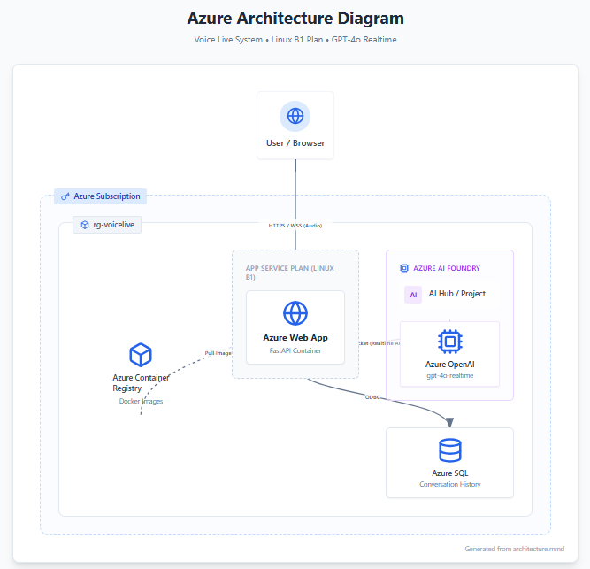

# Real-Time Voice Assistant: Project Overview

This document explains the architecture and deployment considerations for the Real-Time Voice Assistant project.

## Project Description

This application acts as a bridge between a user's browser and the **Azure OpenAI GPT-4o Realtime API**. Unlike standard chatbots that wait for a full message, this system streams audio in real-time, allowing for natural, interruptible voice conversations.

### Core Features

* **Bi-directional Streaming:** Uses WebSockets to stream audio to and from the server.
* **Session Management:** Handles multiple concurrent user connections via Python FastAPI.
* **State Persistence:** Saves conversation context to an Azure SQL Database.
* **Containerized Deployment:** Runs as a Docker container on Azure App Service.

## Azure Architecture Components

The solution is built on Azure Platform-as-a-Service (PaaS) components to ensure scalability and minimize maintenance.

### 1. Azure App Service (Linux B1 Plan)

* **Role:** The application host.
* **Details:** Runs the FastAPI Docker container. It serves the frontend client and manages the WebSocket tunnels between the user and the AI model.
* **Note:** The B1 plan is cost-effective for development but may need scaling for production.

### 2. Azure Container Registry (ACR)

* **Role:** Artifact storage.
* **Details:** Stores the Docker images for the application. When the Web App restarts, it pulls the latest image from here.

### 3. Azure SQL Database

* **Role:** Persistent memory.
* **Details:** Stores chat logs and session history. This ensures that even if the Web App restarts (stateless compute), the conversation history is preserved.

### 4. Azure AI Foundry & OpenAI

* **Role:** The Brain.
* **Details:** Provides the **GPT-4o Realtime** model. The application connects here using a secure backend WebSocket.

## Critical Deployment Considerations

### Security

* **HTTPS is Required:** Browsers will **block microphone access** if the site is loaded over HTTP. You must use the SSL/HTTPS URL provided by Azure (e.g., `https://your-app.azurewebsites.net`).
* **Secret Management:** Database connection strings and API keys are injected as Environment Variables. Never commit these to your Git repository.

### Scalability

* **Session Affinity:** Because this app uses WebSockets, if you scale out to multiple server instances, you **must enable ARR Affinity** in the Azure Portal. This ensures a user's audio packets always go to the same server instance during a session.
* **Database Limits:** The configured "Basic" tier SQL database has a limit on concurrent connections (DTUs). Heavy load may require upgrading to a "Standard" tier.

### Monitoring

* **Logs:** Application logs are streamed to the Azure Portal "Log Stream". Use this to debug WebSocket connection failures or audio encoding issues.

## Quick Start (Deployment)

1. **Prerequisites:** Azure CLI (`az`) and Docker installed.

2. **Deploy:** Run the provided automated script:

   ```bash
   az login
   bash azdeploy.sh
   ```

3. **Access:** Open the output URL in Chrome, Edge, or Safari.

4. **Testing** cd ./src/ uvicorn main:app --reload |or execute| main.py

---

## CI/CD with GitHub Actions

The workflow at [`.github/workflows/deploy.yml`](.github/workflows/deploy.yml) automates deployments to Azure on every push to `main`. It replicates what `azdeploy.sh` option 2 does: builds the Docker image inside ACR and restarts the App Service to pull it.

> **Prerequisite:** Azure infrastructure must already be provisioned once via `bash azdeploy.sh` (option 1) before the workflow can run.

### One-time setup

#### Step 1 — Create an Azure Service Principal with OIDC

Run these commands in Azure Cloud Shell or any terminal with `az` installed. Replace `<subscription-id>` with your own.

```bash
# Create the App Registration
az ad app create --display-name "github-actions-voicelive"

# Capture the client and tenant IDs
CLIENT_ID=$(az ad app list --display-name "github-actions-voicelive" --query "[0].appId" -o tsv)
TENANT_ID=$(az account show --query tenantId -o tsv)
SUBSCRIPTION_ID=$(az account show --query id -o tsv)
APP_OBJECT_ID=$(az ad app list --display-name "github-actions-voicelive" --query "[0].id" -o tsv)

# Create the service principal
az ad sp create --id $CLIENT_ID

SP_OBJECT_ID=$(az ad sp show --id $CLIENT_ID --query id -o tsv)

# Add federated credential so GitHub Actions can authenticate without a password
# Replace <your-github-username> and <your-repo-name>
az ad app federated-credential create \
  --id $APP_OBJECT_ID \
  --parameters '{
    "name": "github-main",
    "issuer": "https://token.actions.githubusercontent.com",
    "subject": "repo:<your-github-username>/<your-repo-name>:ref:refs/heads/main",
    "audiences": ["api://AzureADTokenExchange"]
  }'

echo "CLIENT_ID: $CLIENT_ID"
echo "TENANT_ID: $TENANT_ID"
echo "SUBSCRIPTION_ID: $SUBSCRIPTION_ID"
```

#### Step 2 — Grant the service principal the required roles

```bash
RG="rg-voicelive"                          # your resource group
ACR_ID=$(az acr show -n <ACR_NAME> -g $RG --query id -o tsv)
WEBAPP_ID=$(az webapp show -n <WEBAPP_NAME> -g $RG --query id -o tsv)

# Push images to ACR
az role assignment create --assignee $SP_OBJECT_ID --role AcrPush --scope $ACR_ID

# Update container config and restart the App Service
az role assignment create --assignee $SP_OBJECT_ID --role "Website Contributor" --scope $WEBAPP_ID
```

#### Step 3 — Add GitHub Secrets

Go to your repository → **Settings → Secrets and variables → Actions → New repository secret** and add:

| Secret name | Where to find the value |
|---|---|
| `AZURE_CLIENT_ID` | `$CLIENT_ID` from Step 1 |
| `AZURE_TENANT_ID` | `$TENANT_ID` from Step 1 |
| `AZURE_SUBSCRIPTION_ID` | `$SUBSCRIPTION_ID` from Step 1 |
| `ACR_NAME` | Azure Portal → Container registries, or output of `azdeploy.sh` |
| `WEBAPP_NAME` | Azure Portal → App Services, or output of `azdeploy.sh` |
| `RESOURCE_GROUP` | `rg-voicelive` (default) |

> **Tip — finding ACR_NAME and WEBAPP_NAME:** If you no longer have the deployment output, run:
> ```bash
> az acr list -g rg-voicelive --query "[].name" -o tsv
> az webapp list -g rg-voicelive --query "[].name" -o tsv
> ```

### How it works

After setup, every merge into `main` automatically:
1. Builds a new Docker image inside ACR (tagged with the git commit SHA **and** `latest`)
2. Updates the App Service to point to the new SHA-tagged image
3. Restarts the App Service so the new container is pulled immediately

The live URL is printed at the end of each Actions run.