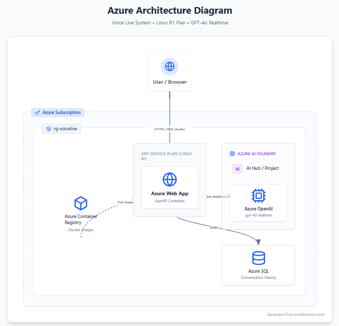

# Real-Time Voice Assistant: Project Overview

This document explains the architecture and deployment considerations for the Real-Time Voice Assistant project.

## Project Description

This application acts as a bridge between a user's browser and the **Azure OpenAI GPT-4o Realtime API**. Unlike standard chatbots that wait for a full message, this system streams audio in real-time, allowing for natural, interruptible voice conversations.

### Core Features

* **Bi-directional Streaming:** Uses WebSockets to stream audio to and from the server.
* **Session Management:** Handles multiple concurrent user connections via Python FastAPI.
* **State Persistence:** Saves conversation context to an Azure SQL Database.
* **Containerized Deployment:** Runs as a Docker container on Azure App Service.

## Azure Architecture Components

The solution is built on Azure Platform-as-a-Service (PaaS) components to ensure scalability and minimize maintenance.

### 1. Azure App Service (Linux B1 Plan)

* **Role:** The application host.
* **Details:** Runs the FastAPI Docker container. It serves the frontend client and manages the WebSocket tunnels between the user and the AI model.
* **Note:** The B1 plan is cost-effective for development but may need scaling for production.

### 2. Azure Container Registry (ACR)

* **Role:** Artifact storage.
* **Details:** Stores the Docker images for the application. When the Web App restarts, it pulls the latest image from here.

### 3. Azure SQL Database

* **Role:** Persistent memory.
* **Details:** Stores chat logs and session history. This ensures that even if the Web App restarts (stateless compute), the conversation history is preserved.

### 4. Azure AI Foundry & OpenAI

* **Role:** The Brain.
* **Details:** Provides the **GPT-4o Realtime** model. The application connects here using a secure backend WebSocket.

## Critical Deployment Considerations

### Security

* **HTTPS is Required:** Browsers will **block microphone access** if the site is loaded over HTTP. You must use the SSL/HTTPS URL provided by Azure (e.g., `https://your-app.azurewebsites.net`).
* **Secret Management:** Database connection strings and API keys are injected as Environment Variables. Never commit these to your Git repository.

### Scalability

* **Session Affinity:** Because this app uses WebSockets, if you scale out to multiple server instances, you **must enable ARR Affinity** in the Azure Portal. This ensures a user's audio packets always go to the same server instance during a session.
* **Database Limits:** The configured "Basic" tier SQL database has a limit on concurrent connections (DTUs). Heavy load may require upgrading to a "Standard" tier.

### Monitoring

* **Logs:** Application logs are streamed to the Azure Portal "Log Stream". Use this to debug WebSocket connection failures or audio encoding issues.

## Quick Start (Deployment)

1. **Prerequisites:** Azure CLI (`az`) and Docker installed.

2. **Deploy:** Run the provided automated script:

   ```bash
   az login
   bash azdeploy.sh
   ```

3. **Access:** Open the output URL in Chrome, Edge, or Safari.

4. **Testing** cd ./src/ uvicorn main:app --reload |or execute| main.py

---

## CI/CD with GitHub Actions

The workflow at [`.github/workflows/deploy.yml`](.github/workflows/deploy.yml) automates deployments to Azure on every push to `main`. It replicates what `azdeploy.sh` option 2 does: builds the Docker image inside ACR and restarts the App Service to pull it.

> **Prerequisite:** Azure infrastructure must already be provisioned once via `bash azdeploy.sh` (option 1) before the workflow can run.

### One-time setup

#### Step 1 — Create an Azure Service Principal with OIDC

Run these commands in Azure Cloud Shell or any terminal with `az` installed. Replace `<subscription-id>` with your own.

```bash
# Create the App Registration
az ad app create --display-name "github-actions-voicelive"

# Capture the client and tenant IDs
CLIENT_ID=$(az ad app list --display-name "github-actions-voicelive" --query "[0].appId" -o tsv)
TENANT_ID=$(az account show --query tenantId -o tsv)
SUBSCRIPTION_ID=$(az account show --query id -o tsv)
APP_OBJECT_ID=$(az ad app list --display-name "github-actions-voicelive" --query "[0].id" -o tsv)

# Create the service principal
az ad sp create --id $CLIENT_ID

SP_OBJECT_ID=$(az ad sp show --id $CLIENT_ID --query id -o tsv)

# Add federated credential so GitHub Actions can authenticate without a password
# Replace <your-github-username> and <your-repo-name>
az ad app federated-credential create \
  --id $APP_OBJECT_ID \
  --parameters '{
    "name": "github-main",
    "issuer": "https://token.actions.githubusercontent.com",
    "subject": "repo:<your-github-username>/<your-repo-name>:ref:refs/heads/main",
    "audiences": ["api://AzureADTokenExchange"]
  }'

echo "CLIENT_ID: $CLIENT_ID"
echo "TENANT_ID: $TENANT_ID"
echo "SUBSCRIPTION_ID: $SUBSCRIPTION_ID"
```

#### Step 2 — Grant the service principal the required roles

```bash
RG="groupoliver"                           # your resource group
RG_ID=$(az group show -n $RG --query id -o tsv)
ACR_ID=$(az acr show -n <ACR_NAME> -g $RG --query id -o tsv)
WEBAPP_ID=$(az webapp show -n <WEBAPP_NAME> -g $RG --query id -o tsv)

# Reader on the resource group — REQUIRED so Azure CLI can discover the subscription
# Without this, login succeeds but fails with "No subscriptions found"
az role assignment create --assignee $SP_OBJECT_ID --role Reader --scope $RG_ID

# Contributor on ACR — required for az acr build (upload source + trigger remote build)
# AcrPush alone is NOT enough: it omits listBuildSourceUploadUrl/action
az role assignment create --assignee $SP_OBJECT_ID --role Contributor --scope $ACR_ID

# Contributor on the Web App — required for az webapp config container set and az webapp restart
# Website Contributor alone is NOT enough: it omits Microsoft.Web/sites/config/list/action
az role assignment create --assignee $SP_OBJECT_ID --role Contributor --scope $WEBAPP_ID
```

#### Step 3 — Add GitHub Secrets

> **Secrets vs Variables — which one?**
> GitHub offers two kinds of stored values under *Settings → Secrets and variables → Actions*:
> - **Secrets** — encrypted, redacted from logs, for sensitive values (passwords, tokens, IDs). Referenced in workflows as `${{ secrets.NAME }}`.
> - **Variables** — plain text, visible in logs, for non-sensitive config. Referenced as `${{ vars.NAME }}`.
>
> **All six values below must be added as Secrets** (not Variables), because the workflow reads them with `${{ secrets.* }}` and because Azure credentials must never appear in plain text in logs.

Navigate to your repository → **Settings → Secrets and variables → Actions → Secrets tab → New repository secret** and add each one:

| Secret name | Where to find the value |
|---|---|
| `AZURE_CLIENT_ID` | `$CLIENT_ID` printed at the end of Step 1 |
| `AZURE_TENANT_ID` | `$TENANT_ID` printed at the end of Step 1 |
| `AZURE_SUBSCRIPTION_ID` | `$SUBSCRIPTION_ID` printed at the end of Step 1 |
| `ACR_NAME` | Registry name only — e.g. `acrabc12345` (not the full `.azurecr.io` URL) |
| `WEBAPP_NAME` | App name only — e.g. `webapp-abc12345` |
| `RESOURCE_GROUP` | The resource group used in `azdeploy.sh` — e.g. `resourcegroup` |

> **Tip — finding ACR_NAME and WEBAPP_NAME:** If you no longer have the deployment output, run:
> ```bash
> az acr list -g groupoliver --query "[].name" -o tsv
> az webapp list -g groupoliver --query "[].name" -o tsv
> ```

### How it works

After setup, every merge into `main` automatically:
1. Builds a new Docker image inside ACR (tagged with the git commit SHA **and** `latest`)
2. Updates the App Service to point to the new SHA-tagged image
3. Restarts the App Service so the new container is pulled immediately

The live URL is printed at the end of each Actions run.

### Troubleshooting

The table below maps each pipeline step to the error it can produce and the fix to apply. Details for each error follow.

| Pipeline step | Error keyword | Root cause | Fix |
|---|---|---|---|
| `Azure Login (OIDC)` | `Not all values are present` | A GitHub Secret is missing or empty | Add all six secrets — see [Step 3](#step-3--add-github-secrets) |
| `Azure Login (OIDC)` | `No subscriptions found` | SP has no role above resource level | Grant `Reader` on resource group |
| `Build image in ACR` | `listBuildSourceUploadUrl` | `AcrPush` insufficient for `az acr build` | Grant `Contributor` on ACR |
| `Update App Service container image` | `sites/config/list/action` | `Website Contributor` missing config permission | Grant `Contributor` on Web App |

> **General rule:** if a step fails, all later steps (`Restart App Service`, `Print deployment URL`) are automatically skipped — they are not separate problems.

---

#### `Azure Login (OIDC)` fails — "Not all values are present"

One or more of the six secrets is missing or empty in GitHub.

**Check:** Go to **Settings → Secrets and variables → Actions** and confirm all six secrets exist and are non-empty:

| Secret | Common mistake |
|---|---|
| `AZURE_CLIENT_ID` | Not added, or confused with Object ID — use the **Application (client) ID** |
| `AZURE_TENANT_ID` | Not added |
| `AZURE_SUBSCRIPTION_ID` | Not added |
| `ACR_NAME` | Registry name only — e.g. `acrabc123`, not `acrabc123.azurecr.io` |
| `WEBAPP_NAME` | App name only — e.g. `webapp-abc123` |
| `RESOURCE_GROUP` | Must match exactly what was used in `azdeploy.sh` — e.g. `resourcegroup` |

**Also verify the federated credential subject matches your repo and branch.** The subject set in Step 1 must be:
```
repo:<your-github-username>/<your-repo-name>:ref:refs/heads/main
```
If you copied the command without replacing the placeholders, delete the credential and recreate it:
```bash
APP_OBJECT_ID=$(az ad app list --display-name "github-actions-voicelive" --query "[0].id" -o tsv)

az ad app federated-credential delete --id $APP_OBJECT_ID --federated-credential-id github-main

az ad app federated-credential create \
  --id $APP_OBJECT_ID \
  --parameters '{
    "name": "github-main",
    "issuer": "https://token.actions.githubusercontent.com",
    "subject": "repo:OliverRevilla/project_azure_accelerator_01:ref:refs/heads/main",
    "audiences": ["api://AzureADTokenExchange"]
  }'
```

---

#### `Azure Login (OIDC)` fails — "No subscriptions found for \*\*\*"

The secrets are correct and the OIDC token exchange succeeded (you can tell because the secrets show as `***` in the logs), but the service principal has no role at the resource group level. Azure CLI cannot list the subscription without at least `Reader` access somewhere above individual resources.

```bash
SP_OBJECT_ID=$(az ad sp show --id $CLIENT_ID --query id -o tsv)
RG_ID=$(az group show -n groupoliver --query id -o tsv)
az role assignment create --assignee $SP_OBJECT_ID --role Reader --scope $RG_ID
```

---

#### `Build image in ACR` fails — `AuthorizationFailed` on `listBuildSourceUploadUrl`

`az acr build` uploads source code to ACR before triggering a remote build. This requires `Microsoft.ContainerRegistry/registries/listBuildSourceUploadUrl/action`, which is **not** included in `AcrPush`. The correct role is `Contributor` on the ACR resource.

```bash
SP_OBJECT_ID=$(az ad sp show --id $CLIENT_ID --query id -o tsv)
ACR_ID=$(az acr show -n <ACR_NAME> -g groupoliver --query id -o tsv)

az role assignment delete --assignee $SP_OBJECT_ID --role AcrPush --scope $ACR_ID 2>/dev/null || true
az role assignment create --assignee $SP_OBJECT_ID --role Contributor --scope $ACR_ID
```

---

#### `Update App Service container image` fails — `AuthorizationFailed` on `sites/config/list/action`

`az webapp config container set` requires `Microsoft.Web/sites/config/list/action` to read the current app settings before writing. This action is **not** included in `Website Contributor`. The correct role is `Contributor` on the Web App resource.

```bash
SP_OBJECT_ID=$(az ad sp show --id $CLIENT_ID --query id -o tsv)
WEBAPP_ID=$(az webapp show -n <WEBAPP_NAME> -g resourcegroup --query id -o tsv)

az role assignment delete --assignee $SP_OBJECT_ID --role "Website Contributor" --scope $WEBAPP_ID 2>/dev/null || true
az role assignment create --assignee $SP_OBJECT_ID --role Contributor --scope $WEBAPP_ID
```

---

## Roadmap & New Features

We are planning to implement several exciting new features to turn this project into a more robust and complete application:

*   **Dynamic Personas:** Dynamic configuration in the UI before a session starts to select different voices (e.g., alloy, echo, shimmer, etc.) and system prompts. This allows the assistant to adopt different personas instantly (e.g., travel guide, grumpy pirate, formal assistant).
*   **Chat History Management:** A new dashboard in the UI allowing users to view past text transcripts from the database. Users will be able to load older sessions and review the context of previous conversations.
*   **Export Transcription:** An option in the UI that lets users download their session transcripts natively to `.txt` or `.md` files for record-keeping and offline review.